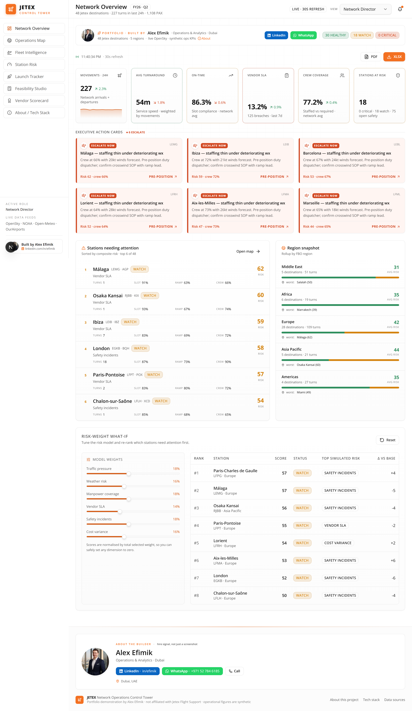
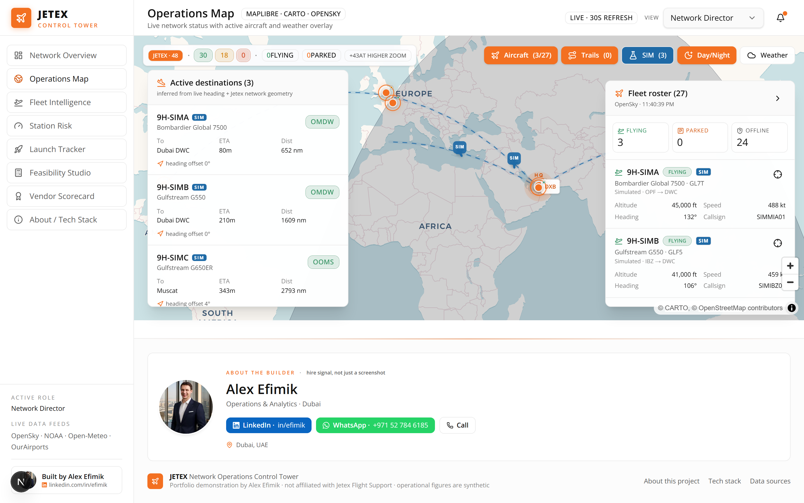
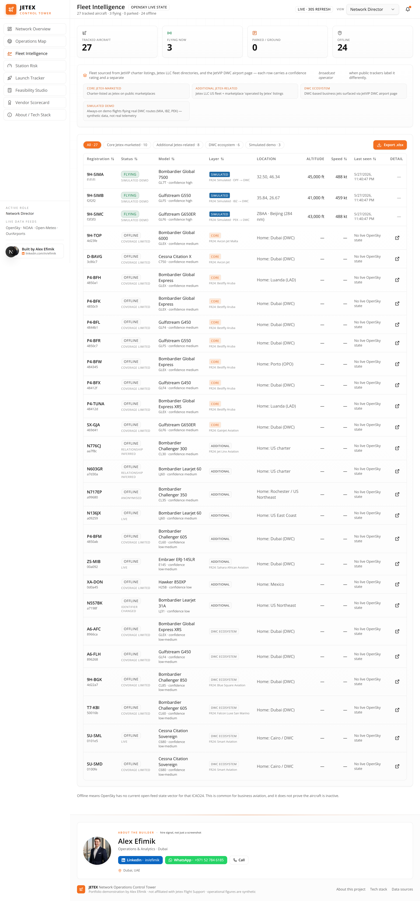
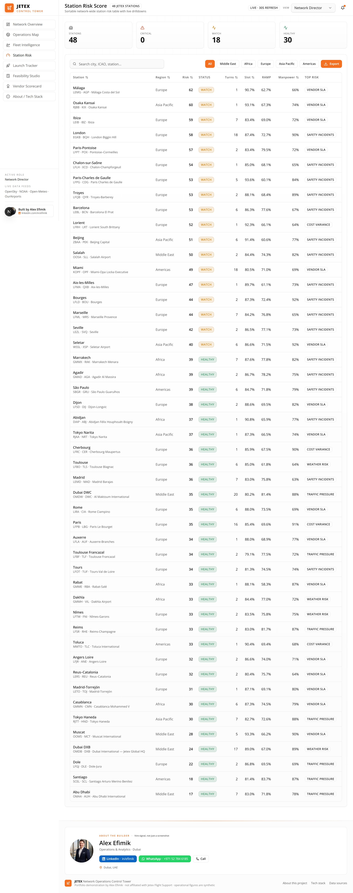
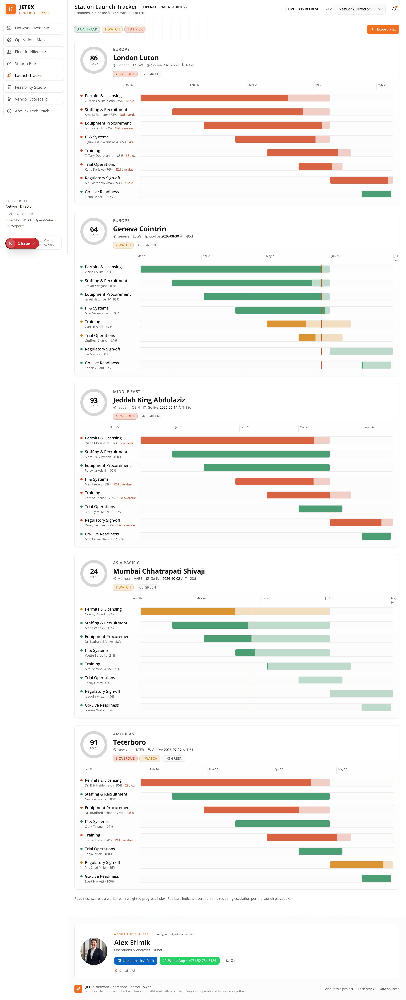
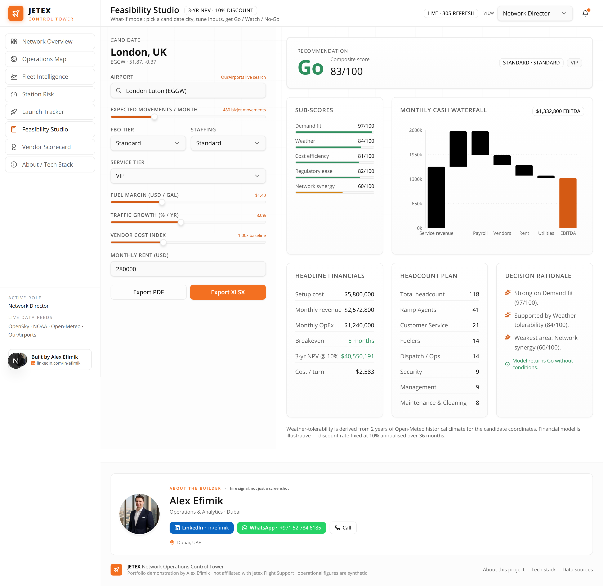
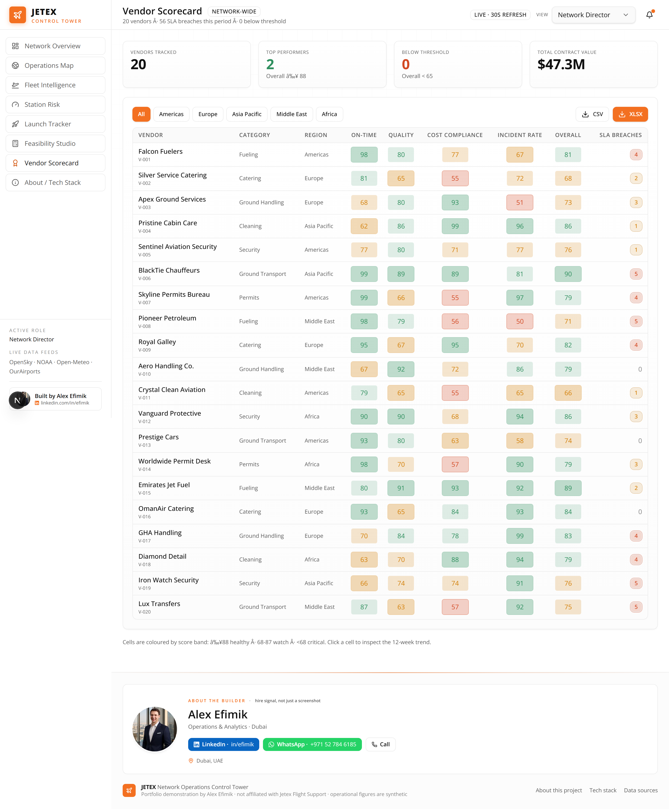

<div align="center">


# Jetex Network Operations Control Tower

**A decision-support dashboard for senior FBO operations managers —**
**which station needs attention today, why, and what should we do about it?**

[](https://control-tower-sand-theta.vercel.app)
[](https://www.linkedin.com/in/efimik/)
[](https://wa.me/971527846185)

[](https://nextjs.org)
[](https://react.dev)
[](https://www.typescriptlang.org)
[](https://tailwindcss.com)
[](https://maplibre.org)
[](LICENSE)

</div>

---

> **Portfolio project by [Alex Efimik](https://www.linkedin.com/in/efimik/) (Dubai, UAE) — submitted alongside my CV for the Operations Analyst role at Jetex.**
> Not affiliated with Jetex Flight Support. Real public data (live aircraft, weather, airport metadata) is plumbed through a Next.js dashboard alongside clearly-labelled synthetic operational KPIs.

---

## TL;DR for a recruiter in 60 seconds

- **What it is** — a BI-grade web dashboard that mirrors how a Jetex Operations Analyst would actually use software each morning: scan KPIs across 48 destinations, click into the worst stations, run feasibility studies for new ones, watch the live ramp, and export briefings for management.
- **Why I built it** — to demonstrate that I understand the *job*, not just frontend frameworks. Every module maps to a specific bullet on the Jetex JD (see the [JD ↔ Module map](#jd-↔-module-map) below).
- **What's real vs synthetic** — aircraft positions (OpenSky), weather (NOAA + Open-Meteo), airport metadata (OurAirports), and the 48-station roster are **real**. Internal operating KPIs (turns, PAX, SLAs, incidents, costs) are **deterministically synthetic** and labelled as such in-app.
- **How to evaluate it** — open the [live demo](https://control-tower-sand-theta.vercel.app), or scroll through the [screenshots](#screenshots) below. Source is in this repo, MIT-licensed.

**Get in touch:** &nbsp; [LinkedIn](https://www.linkedin.com/in/efimik/) · [WhatsApp +971 52 784 6185](https://wa.me/971527846185) · [Live demo](https://control-tower-sand-theta.vercel.app)

---

## Screenshots

### Network Overview — `/`
Six leading-indicator KPIs (turnaround, on-time, vendor SLA, crew coverage, stations at risk), executive action cards with severity tone, a ranked attention list, region snapshot, and an interactive risk-weight what-if simulator.



### Operations Map — `/map`
MapLibre globe with tier-sized station markers (Ultra-VIP / VIP / Standard), a moving day-night terminator, live OpenSky aircraft, fading 30-min trails, three always-on simulated DWC↔MIA / IBZ / PEK demo flights, weather overlay, and an inferred active-destinations panel.



### Fleet Intelligence — `/fleet`
Sortable / filterable fleet table with flying / parked / offline status, drilldown into per-aircraft recent flight history via OpenSky `/flights/aircraft`, and one-click XLSX export.



### Station Risk — `/stations` (+ `/stations/[icao]`)
Composite-risk index across all stations with the top driver per row. Click any station for a full drilldown — live METAR/TAF, trend charts, vendor breaches, manpower coverage, cost variance.



### Launch Tracker — `/launches`
Per-station Gantt board across the 8-workstream go-live playbook (permits → staffing → equipment → IT → training → trial ops → regulatory sign-off → go-live) with weighted readiness score and overdue auto-escalation.



### Feasibility Studio — `/feasibility`
What-if model for new station candidates. OurAirports type-ahead picks any airport worldwide, Open-Meteo feeds the weather sub-score, and the engine outputs a **Go / Watch / No-Go** verdict with 3-yr NPV, breakeven, headcount, cash waterfall and PDF briefing export.



### Vendor Scorecard — `/vendors`
Heatmap of vendors × KPI categories (on-time, quality, cost compliance, incident rate, overall). Click a cell for the 12-week trend modal; XLSX / CSV export.



### About / Tech Stack — `/about`
Builder identity hero, JD mapping table, full tech stack, and a row-by-row real-vs-synthetic data provenance table for the hiring team.


---

## JD ↔ Module map

The Jetex Operations Analyst job description and where each line of it shows up in this dashboard:

| Job-description signal | Where it shows up |
| --- | --- |
| *Oversee operational performance across multiple locations* | Network Overview KPI deck + Operations Map |
| *Monitor and analyse key operational KPIs* | Network Overview, Station Risk index, drilldowns |
| *Lead operational oversight of new station launches, ensuring readiness prior to go-live* | Launch Tracker with weighted readiness score |
| *Conduct operational feasibility studies (infrastructure, staffing, traffic, cost)* | Feasibility Studio + waterfall financial model |
| *Manage and evaluate third-party vendor performance against SLAs* | Vendor Scorecard heatmap + trend modal |
| *Power BI / Advanced Excel proficiency* | BI-style drilldown UX + XLSX / CSV / PDF exports on every screen |

The "click any KPI → filtered detail view" pattern that Power BI users rely on is wired into every module — every station chip, vendor cell, fleet row, action card and map pin leads to a drilldown.

---

## Tech stack

**Framework & UI**
- Next.js 16 (App Router, Turbopack, React Server Components)
- React 19 + TypeScript (strict)
- Tailwind CSS v4 with Jetex orange / white token palette
- shadcn-style primitives, locally authored in [`components/ui/*`](components/ui/)
- Lucide icons + Open Sans

**Data & visualisation**
- [TanStack Query](https://tanstack.com/query) for client polling + server-hydrated cache
- [MapLibre GL JS](https://maplibre.org) via [`react-map-gl`](https://visgl.github.io/react-map-gl/) with the free CARTO Voyager style
- [Recharts](https://recharts.org) for KPI trend strips, radars, waterfalls and history charts
- [Zod](https://zod.dev) for API request validation

**Exports & engines**
- [SheetJS / xlsx](https://sheetjs.com) — every table exports to .xlsx / .csv
- [jsPDF](https://github.com/parallax/jsPDF) — Network Overview and Feasibility briefings
- [Faker.js](https://fakerjs.dev) — deterministic seeded synthetic operational dataset
- Custom risk engine — weighted composite + what-if simulator

**Deployment**
- Vercel (Edge runtime for OG image + favicon)
- Dynamic `opengraph-image.tsx`, `icon.tsx`, `apple-icon.tsx`, `robots.ts`, `sitemap.ts`

---

## Data sources — real vs synthetic

| Source | Origin | Where used |
| --- | --- | --- |
| Jetex destination roster — 48 FBOs across 5 regions, ICAO/IATA from public airport DBs | **Real** | All modules |
| Live aircraft state vectors — [OpenSky `/states/all`](https://opensky-network.org) | **Real** | Operations Map, Fleet Intelligence |
| Recent flights per aircraft — [OpenSky `/flights/aircraft`](https://openskynetwork.github.io/opensky-api/rest.html) | **Real** | Aircraft drilldown |
| METAR / TAF — [NOAA Aviation Weather](https://aviationweather.gov/data/api/) | **Real** | Station drilldown |
| Historical climate (2-yr reanalysis) — [Open-Meteo](https://open-meteo.com/en/docs/historical-weather-api) | **Real** | Feasibility weather sub-score |
| Worldwide airport autocomplete — [OurAirports](https://ourairports.com/data/) | **Real** | Feasibility Studio |
| Station KPIs — turns, PAX, fuel, manpower, SLA, incidents, cost | **Synthetic** | All modules |
| Launch workstream milestones | **Synthetic** | Launch Tracker |
| Vendor scorecards | **Synthetic** | Vendor Scorecard |

Synthetic data is generated deterministically from a Faker.js seed so the dashboard renders the same numbers every reload. Magnitudes are calibrated to realistic *business aviation* volumes (Jetex isn't an airline) — ~180–220 turns/day network-wide, 3–7 PAX per movement.

---

## Run it locally

```bash
git clone https://github.com/Alexey3250/control-tower.git
cd control-tower
npm install
cp .env.local.example .env.local   # optional — for OpenSky credentials
npm run dev                         # http://localhost:3000
```

Or as a production build:

```bash
npm run build && npm start
```

The dashboard works fully without environment variables — anonymous OpenSky access covers the demo. For higher rate limits, set `OPENSKY_USER` / `OPENSKY_PASS` in `.env.local`.

**Re-capture screenshots** (this README's images):
```bash
npm run screenshots
```

The script spins up its own dev server on a free port, walks every module with Playwright at 1440×900 @ 2x and writes the PNGs back to `docs/screenshots/`.

**Re-generate synthetic data CSVs** (in `data/`):
```bash
npm run gen:data
```

---

## Repo layout

```
app/                 Next 16 App Router — pages, route handlers, OG image
  (dashboard)/       Authenticated-feel shell — sidenav, topbar, footer
  api/               JSON endpoints for KPIs, risk, feasibility, fleet
  opengraph-image    Dynamic 1200×630 social card
components/
  overview/          Network-overview widgets (KPI cards, action cards, sim)
  map/               MapLibre + day/night terminator + flights
  feasibility/       Form, waterfall chart, briefing
  launch/            Gantt board, readiness score
  vendor/            Heatmap, trend modal
  fleet/             Fleet table + drilldown
  stations/          Station risk table + drilldown
  shell/             Sidenav, topbar, footer, builder card
  ui/                shadcn-style primitives (locally authored)
  kpi/               Reusable KPI tiles, status pills, trend strips
config/
  network.ts         48 Jetex destinations (ICAO, IATA, lat/lon, tier, region)
  fleet.ts           Tracked aircraft + simulated demo flights metadata
  builder.ts         Builder profile (LinkedIn, WhatsApp, photo, demo URL)
lib/
  data/              API clients (OpenSky, NOAA, Open-Meteo, OurAirports)
  mock/seed.ts       Faker-deterministic synthetic dataset generator
  sim/routes.ts      Simulated flights — great-circle math, position fn
  risk.ts            Weighted composite risk engine
  terminator.ts      Astronomical day/night terminator polygon
scripts/
  generate-synthetic.mjs    CLI for `data/*.csv`
  capture-screenshots.mjs   Playwright README-screenshot pipeline
docs/screenshots/    The PNGs embedded in this README
```

---

## Disclaimers

- This is an independent portfolio project. It is **not affiliated with, endorsed by, or operated by Jetex Flight Support**. The Jetex name, logo and corporate styling are used only as a demonstration of brand fluency for a recruiting context.
- All operational KPIs (turns, PAX, fuel uplift, manpower coverage, vendor SLAs, incidents, cost variance, launch milestones) are **synthetic** and generated deterministically from a Faker.js seed. They are designed to be realistic in shape and distribution, not to represent actual Jetex operating performance.
- Real data — aircraft positions, METAR/TAF, historical weather, airport metadata — is pulled from clearly-attributed public APIs and is subject to those providers' rate limits.
- Source code is released under the [MIT License](LICENSE).

---

## Contact

I built this to show what I'd actually do as an Operations Analyst at Jetex. If that lands, I'd love to walk you through it.

- **LinkedIn:** [linkedin.com/in/efimik](https://www.linkedin.com/in/efimik/)
- **WhatsApp / phone:** [+971 52 784 6185](https://wa.me/971527846185)
- **Live demo:** [control-tower-sand-theta.vercel.app](https://control-tower-sand-theta.vercel.app)
- **Location:** Dubai, UAE

*Alex Efimik — Operations & Analytics*
